# 🔰SAPHostAgentを利用してSAPインスタンスを起動停止してみるWithWindows

SAPHostAgentを利用してSAPの起動停止を行ってみる。

ちなみにSAPの起動停止ではstartsap/stopsapという物も存在していますが、sap note:809477に

>The startsap and stopsap commands are deprecated, as of April 2015. The scripts will receive no fixes and it is not recommended to use them anymore.

と記載されているので、本記事で用いているsapcontrol.exeを利用した起動停止にしたほうが良さげ。

関連note

- [809477 - startsap/stopsap for SAP WebAs 640, 700, 701, 710, 711, 720](https://launchpad.support.sap.com/#/notes/0000809477)
- [1763593 - Starting and stopping SAP system instances - startsap/stopsap are deprecated](https://launchpad.support.sap.com/#/notes/1763593)

## 🔰SAPHostAgentってなんぞや？

SAPHostAgentは、OSの監視やDBの監視やSAPインスタンスの制御など複数のライフサイクル管理タスクを実行できるエージェント。
SAP kernel 7.20以上のSAPインスタンスをインストールする場合は一緒にインストールされる。

個別にインストールする場合は下記noteを参照。

- [1031096 - Installing Package SAPHOSTAGENT](https://launchpad.support.sap.com/#/notes/1031096)

## 🔰SAPHostAgentのインストール場所（Windows）

Windowsでは下記ディレクトリにインストールされる。

%ProgramFiles%\SAP\hostctrl\exe

またワークディレクトリは下記。

%ProgramFiles%\SAP\hostctrl\work

本資料ではexeディレクトにある、**saphostexe.exe**と**sapcontrol.exe**を利用してSAPインスタンスの起動停止を行う。

今回は実行ユーザを\<sid\>admで実行を行います。なおSAPインスタンスの起動停止を行うには**管理者権限**が必要です。

## 🔰SAPHostAgentのバージョンを確認してみる

%ProgramFiles%\SAP\hostctrl\exeのディレクトリにあるsaphostexec.exeに引数versionをつけて実行するとバージョンが確認できます。

`.\saphostexec.exe -version`でインストールされているSAPHostAgentのバージョンが確認できる。  
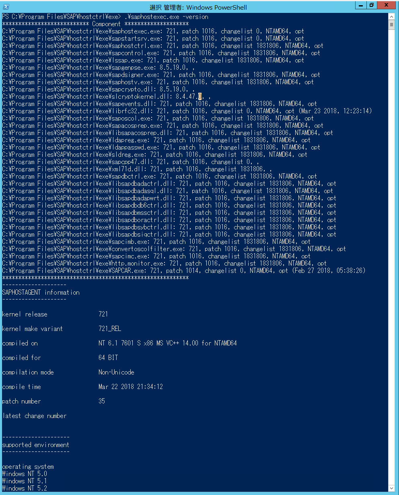

## 🔰saphostexecのステータスを確認してみる。

`.\saphostexec.exe -status`でステータスを確認できます。

下記の例だとrunningになっていてprocessIdが表示されます。

一応、`Get-Process`でもどんな物か確認してみる。

saphostexecとGet-Processでサービスの状態を確認してみる  
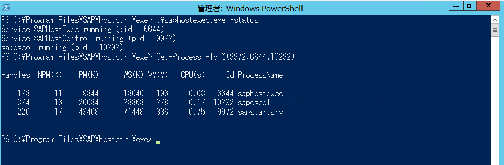

## 🔰saphostexec.exeとsapcontrol.exeについて確認してみる

### 🔰saphostexec

`.\saphostexec.exe`にパラメータを付けずに実行するとhelpがみれます。

saphostexec.exeのhelp  
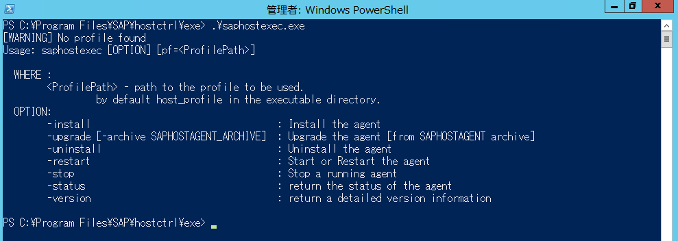

### 🔰sapcontrol.exe

`.\sapcontrol.exe`にパラメータを付けずに実行するとhelpがみれます。

大量のパラメータがあります。
あとヘルプにNoteにも書いてあるますが、詳細はhttp：//scn.sap.com/docs/DOC-14382を参照。

sapcontrol.exeのhelp  
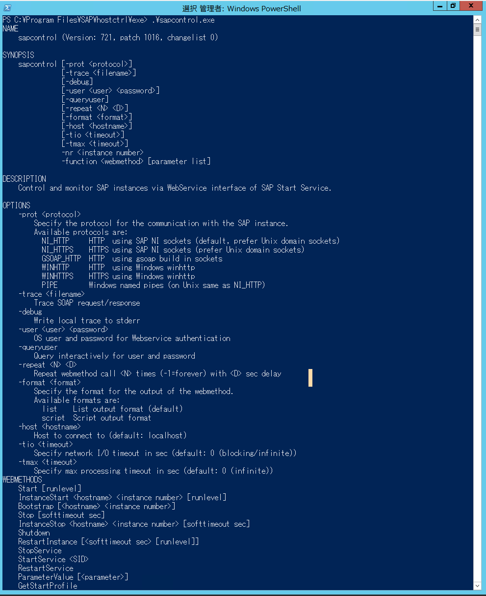

```Powershell
NAME
    sapcontrol (Version: 721, patch 1016, changelist 0)

SYNOPSIS
    sapcontrol [-prot <protocol>]
               [-trace <filename>]
               [-debug]
               [-user <user> <password>]
               [-queryuser]
               [-repeat <N> <D>]
               [-format <format>]
               [-host <hostname>]
               [-tio <timeout>]
               [-tmax <timeout>]
               -nr <instance number>
               -function <webmethod> [parameter list]

DESCRIPTION
    Control and monitor SAP instances via WebService interface of SAP Start Service.

OPTIONS
    -prot <protocol>
        Specify the protocol for the communication with the SAP instance.
        Available protocols are:
          NI_HTTP     HTTP  using SAP NI sockets (default, prefer Unix domain sockets)
          NI_HTTPS    HTTPS using SAP NI sockets (prefer Unix domain sockets)
          GSOAP_HTTP  HTTP  using gsoap build in sockets
          WINHTTP     HTTP  using Windows winhttp
          WINHTTPS    HTTPS using Windows winhttp
          PIPE        Windows named pipes (on Unix same as NI_HTTP)
    -trace <filename>
        Trace SOAP request/response
    -debug
        Write local trace to stderr
    -user <user> <password>
        OS user and password for Webservice authentication
    -queryuser
        Query interactively for user and password
    -repeat <N> <D>
        Repeat webmethod call <N> times (-1=forever) with <D> sec delay
    -format <format>
        Specify the format for the output of the webmethod.
        Available formats are:
          list    List output format (default)
          script  Script output format
    -host <hostname>
        Host to connect to (default: localhost)
    -tio <timeout>
        Specify network I/O timeout in sec (default: 0 (blocking/infinite))
    -tmax <timeout>
        Specify max processing timeout in sec (default: 0 (infinite))
WEBMETHODS
    Start [runlevel]
    InstanceStart <hostname> <instance number> [runlevel]
    Bootstrap [<hostname> <instance number>]
    Stop [softtimeout sec]
    InstanceStop <hostname> <instance number> [softtimeout sec]
    Shutdown
    RestartInstance [<softtimeout sec> [runlevel]]
    StopService
    StartService <SID>
    RestartService
    ParameterValue [<parameter>]
    GetStartProfile
    GetTraceFile
    GetAlertTree
    GetAlerts
    GetEnvironment
    GetVersionInfo
    GetQueueStatistic
    GetProcessList
    GetInstanceProperties
    ListDeveloperTraces
    ReadDeveloperTrace <filename> <filesize>
    ListLogFiles
    ReadLogFile <filename> [<filter> [<language> [<maxentries> [<cookie>]]]]
    AnalyseLogFiles [<severity 0..2> [<maxentries>
        [<starttime YYYY MM DD HH:MM:SS> <endtime YYYY MM DD HH:MM:SS>]]]
    ConfigureLogFileList set|add|remove [<filename1> <filename2>... <filenameN>]
    GetLogFileList
    CreateSnapshot [<description> [<datcol_param> [<analyse_severity -1..2>
        [<analyse_maxentries> [<analyse_starttime YYYY MM DD HH:MM:SS>
        <analyse_endtime YYYY MM DD HH:MM:SS> [maxentries
        [<filename1> ... <filenameN>]]]]]]]
    ReadSnapshot <filename> [<local filename>]
    ListSnapshots
    DeleteSnapshots <filename1> [<filename2>... <filenameN>]
    GetAccessPointList
    GetProcessParameter <processtype> [pid]
    SetProcessParameter <processtype> <pid> <parameter> <value1>
        [<value2> ... <valueN>]
    OSExecute <command> <async> <timeout> <protocolfile>
    SendSignal <pid> <signal>
    GetCallstack <pid>
    GetSystemInstanceList [<timeout sec>]
    StartSystem [ALL|SCS|DIALOG|ABAP|J2EE|TREX|ENQREP|HDB|ALLNOHDB|LEVEL <level>
        [<waittimeout sec> [runlevel]]]
    StopSystem [ALL|SCS|DIALOG|ABAP|J2EE|TREX|ENQREP|HDB|ALLNOHDB|LEVEL <level>
        [<waittimeout sec> [<softtimeout sec>]]]
    RestartSystem [ALL|SCS|DIALOG|ABAP|J2EE|TREX|ENQREP|HDB|ALLNOHDB|LEVEL <level>
        [<waittimeout sec> [<softtimeout sec> [runlevel]]]]
    AccessCheck <function>
    GetSecNetworkId <service_ip> <service_port> [<version> [<challenge>]]
    GetNetworkId <service_ip> <service_port> [<version>]
    RequestLogonFile <user>
    HACheckConfig
    HACheckFailoverConfig
    HAGetFailoverConfig
    HAFailoverToNode <node>
    ABAPReadSyslog
    ABAPReadRawSyslog
    ABAPGetWPTable
    ABAPGetSystemWPTable [<activeonly>]
    J2EEControlProcess <processname> <function>
    J2EEControlCluster <processname> <function> [<hostname> <instance number>]
    J2EEEnableDbgSession <client> [<processname> <debugflags>]
    J2EEDisableDbgSession <debugkey>
    J2EEGetProcessList
    J2EEGetProcessList2
    J2EEGetThreadList
    J2EEGetThreadList2
    J2EEGetThreadCallStack [<threadindex>]
    J2EEGetThreadTaskStack [<threadindex>]
    J2EEGetSessionList
    J2EEGetCacheStatistic
    J2EEGetCacheStatistic2
    J2EEGetApplicationAliasList
    J2EEGetComponentList
    J2EEControlComponents <process name> <operation> <componenttype>
        <componentname1>,...,<componentnameN>
    J2EEGetWebSessionList
    J2EEGetWebSessionList2
    J2EEGetEJBSessionList
    J2EEGetRemoteObjectList
    J2EEGetVMGCHistory
    J2EEGetVMGCHistory2
    J2EEGetVMHeapInfo
    J2EEGetClusterMsgList
    J2EEGetSharedTableInfo
    ICMGetThreadList
    ICMGetConnectionList
    ICMGetProxyConnectionList
    ICMGetCacheEntries
    WebDispGetServerList
    EnqGetStatistic
    EnqGetLockTable
    StartWait <timeout sec> <delay sec> [runlevel]
    StopWait <timeout sec> <delay sec>
    WaitforStarted <timeout sec> <delay sec>
    WaitforStopped <timeout sec> <delay sec>
    RestartServiceWait <timeout sec> <delay sec>
    WaitforServiceStarted <timeout sec> <delay sec>
    CheckHostAgent

EXITCODES
    0  Last webmethod call successful
    1  Last webmethod call failed, invalid parameter
    2  StartWait, StopWait, WaitforStarted, WaitforStopped, RestartServiceWait
       timed out
    3  GetProcessList succeeded, all processes running correctly
    4  GetProcessList succeeded, all processes stopped

SECURITY
    Trusted connects without user and password check are possible through
    Unix domain socket or Windows named pipes. Protected webmethods like
    Start or Stop require a trusted connection or OS user and password
    authentication.

EXAMPLES
    sapcontrol -nr 0 -function GetProcessList
      Gets the list of processes on instance 00 on localhost

NOTES
    A detailed description of the SAPControl webservice interface is available on
    http://scn.sap.com/docs/DOC-14382. The actual interface definition can be queried
    from the SAP Start Service via http://<host>:5XX13/?wsdl or https://<host>:5xx14/?wsdl.
    The WSDL contains a short documentation of each webmethod (XML tags "<documentation>").
    SAP MMC (http://scn.sap.com/docs/DOC-8294) provides a graphical user interface as
    Snap-In for the Microsoft Management Console and SAP MC provides a graphical user
    interface as Java Swing UI launched from a browser (http://<host>:5XX13
    or https://<host>:5XX14).
```

## 🔰saphostexec.exeとsapcontrol.exeを利用してSAPインスタンスを起動してみる。

今回は下記条件のSAPインスタンスを起動してみる。

- ASCSのInstanceNoが01。(MESSAGESERVER|ENQUE)
- PASのInstanceNoが00。(ABAP|GATEWAY|ICMAN|IGS)

ちなみにsapcontrolのwebmethodにあるGetSystemInstanceListを利用するとインスタンスの情報を取得する事ができたりします。

```Powershell
# インスタンスのリストをsapcontrolを利用して取得
sapcontrol.exe -nr <instanceNo> -function GetSystemInstanceList
```

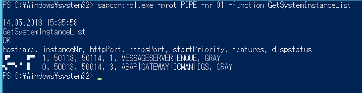

まずは下記のWindowsServiceの状態を確認する。

- SAP\<SID\>_InstanceNo
- SAPHostControl
- SAPHostExec

Powershellの`Get-Service`コマンドでサービスの確認  
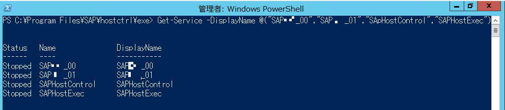

全部動いていない状態なのでサービスを起動する。

PowershellのStart-Serviceでも良いが、せっかく？　なので、**saphostexec.exe**と**saphostcontrol.exe**を利用してサービスを起動してみる。

saphostexec.exeからsaphostexecとsaphostcontrolのサービスを起動する。

サービスを起動 or 再起動するにはsaphostexec.exeにrestartオプションをつけて実行する。

SAPHostExecとSAPHostControlがRunningになりました。

```Powerhsll
.\saphostexec.exe -restart
```

SAPHostExecとSAPHostControlがRunning。  
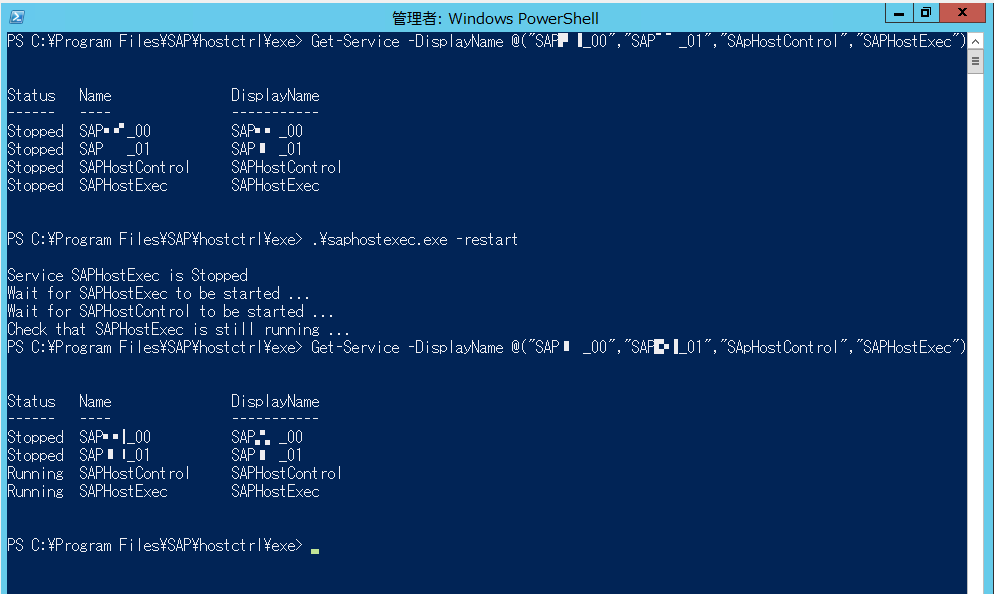

sapcontrol.exeから**SAPSID_nr**のサービスを起動する。

sapcontrolからサービスを起動するには下記のようにInstanceNoとfunction StartService \<SID\>を指定する。

```Powershell
sapcontrol.exe -prot PIPE -nr 01 -function StartService <SID>
sapcontrol.exe -prot PIPE -nr 00 -function StartService <SID>
```

SAPサービスがRunning。  


サービスが起動したのでSAPInstanceを起動する。

一応念の為、インスタンスが止まっていること（プロセスが動いてない）事を確認。

```Powerhsll
.\sapcontrol.exe -prot PIPE -nr -01 function GetProcessList
.\sapcontrol.exe -prot PIPE -nr -00 function GetProcessList
```

sapcontrolのGetProcessListを実行してプロセスがない事を確認  
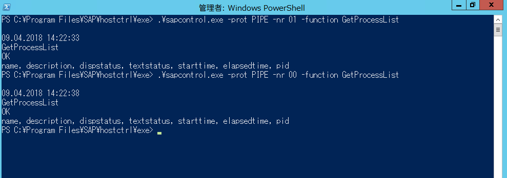

まずはASCSのInstanceNo01から起動する。

```Powershell
# InstanceNo 01を起動
.\sapcontrol.exe -prot PIPE -nr 01 -function StartSystem
# プロセスが起動している事を確認
.\sapcontrol.exe -prot PIPE -nr 01 -function GetProcessList
```

dispstatusがGREENでtextstatusがRunning  
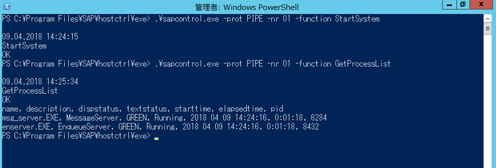

ASCSが起動したのでPASの起動を行う。

```Powershell
# InstanceNo 00を起動
.\sapcontrol.exe -prot PIPE -nr 00 -function StartSystem
# プロセスが起動している事を確認
.\sapcontrol.exe -prot PIPE -nr 00 -function GetProcessList
```

dispstatusがGREENでtextstatusがRunning  


SAPが起動してSAPGuiで接続できる事が確認できました。

SAPGuiで接続確認  
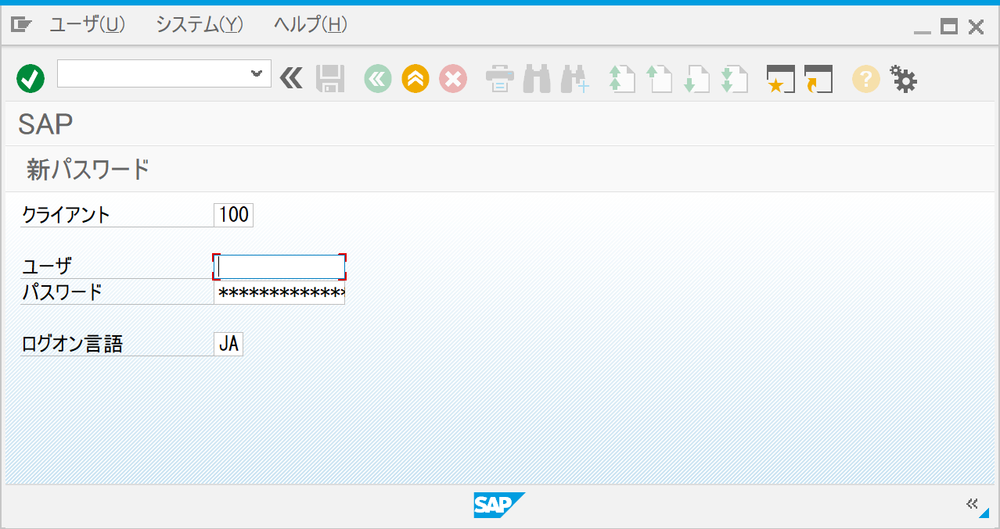

## 🔰saphostexec.exeとsapcontrol.exeを利用してSAPインスタンスを停止してみる。

まずはPASのInstanceNo00からインスタンスの停止を行う。

```Powershell
# InstanceNo 00を停止
.\sapcontrol.exe -prot PIPE -nr 00 -function StopSystem
# プロセスが停止している事を確認
.\sapcontrol.exe -prot PIPE -nr 00 -function GetProcessList
```

プロセスが止まっている事を確認  
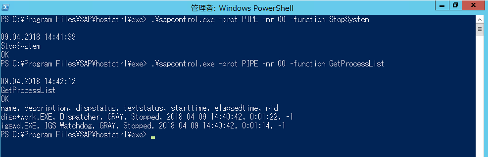

PAS InstanceNo00が停止したのを確認した後に、ASCS InstanceNo01 の停止を行う。

```Powershell
# InstanceNo 01を停止
.\sapcontrol.exe -prot PIPE -nr 01 -function StopSystem
# プロセスが停止している事を確認
.\sapcontrol.exe -prot PIPE -nr 01 -function GetProcessList
```

プロセスが止まっている事を確認  
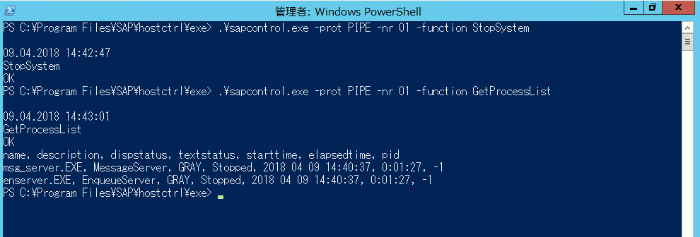

サービスも停止しておく。

```Powershell
.\sapcontrol.exe -prot PIPE -nr 01 -function StopService
.\sapcontrol.exe -prot PIPE -nr 00 -function StopService
.\saphostexec.exe -stop
```

全部止まりました  
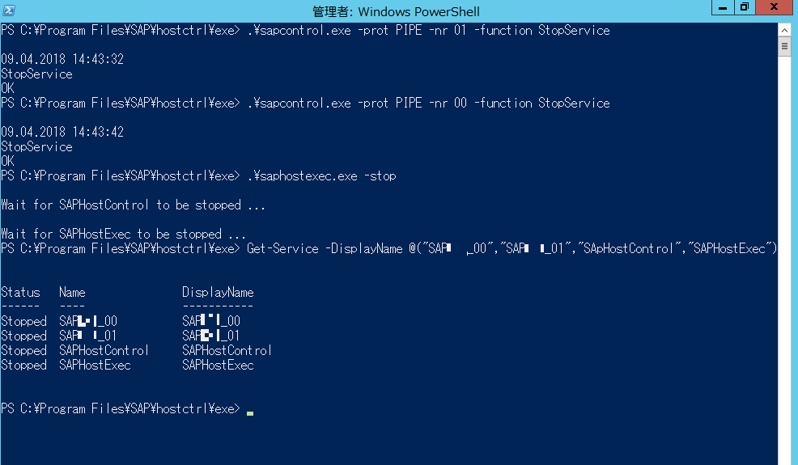

## 🔰総評

sapcontrol.exeでwebmethod StartSystemとStopSystemを利用してSAPインスタンスを一つずつ起動停止を行いました。

が、StartSystemとStopSystemにはALLというパラメータがあって、インスタンスを全部起動停止してくれたり。

StartWaitとStopWaitのように指定した時間インスタンスが処理されるのを待つようなwebmethodがあったり。

場合場合に合わせた起動停止方法が考えられるかと思います。

今回はSAPインスタンスの起動停止を行いましたが、必要ならばDBの停止も適宜行って下さい。
